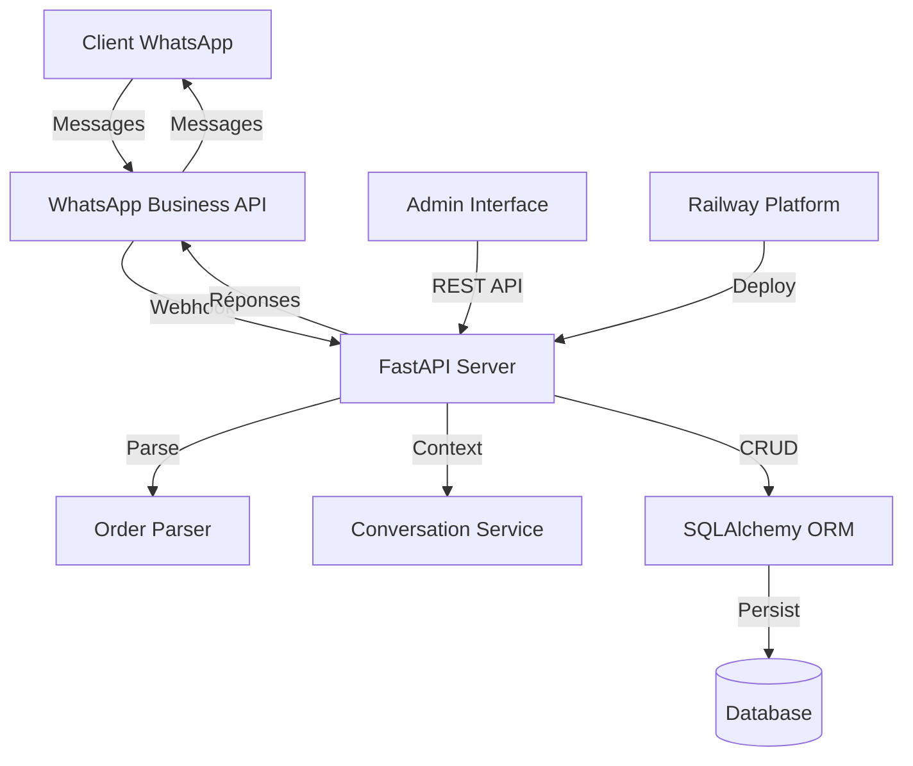

# WhatsApp AI Agent - Documentation Technique

## Vue d'ensemble

Agent conversationnel intelligent pour WhatsApp Business permettant aux clients de passer des commandes via une interface de messagerie naturelle. Le système intègre un parsing robuste des commandes, un menu interactif, et un workflow de validation complet.

## Architecture Système

### Stack Technologique
- **Backend**: FastAPI (Python 3.11+)
- **Base de données**: SQLAlchemy + SQLite/PostgreSQL
- **API de messagerie**: WhatsApp Business Cloud API v22.0
- **Déploiement**: Railway.app
- **Parsing**: Règles linguistiques + expressions régulières

### Diagramme d'architecture



## Composants Principaux

### 1. WhatsApp Service (`WhatsAppService`)
**Responsabilités:**
- Communication avec l'API WhatsApp Business Cloud
- Envoi de messages texte et interactifs
- Gestion des menus de liste (List Messages)

**Méthodes clés:**
```python
def send_message(to: str, message: str) -> bool
def send_interactive_menu(to: str, products: List[Dict]) -> bool
```

### 2. Order Parser (`OrderParser`)
**Responsabilités:**
- Analyse des messages clients en langage naturel
- Extraction des produits et quantités
- Mapping des synonymes et variantes

**Algorithme de parsing:**
1. Normalisation du texte (suppression accents, minuscules)
2. Division sur séparateurs (virgules, "et", "+")
3. Extraction quantité via regex `(\d+)\s*(?:x|×)?`
4. Matching produits par synonymes (longueur décroissante)

**Exemples supportés:**
- `"2 margherita"` → 2x Pizza Margherita
- `"2 margherita et 1 coca"` → 2x Pizza Margherita + 1x Coca-Cola
- `"pizza pepperoni"` → 1x Pizza Pepperoni

### 3. Conversation Service (`ConversationService`)
**Responsabilités:**
- Gestion du contexte conversationnel
- Détection d'intentions
- Orchestration du workflow de commande

**Machine à états:**
```
new → greeted → menu_shown → order_building → order_confirmed
```

**Détection d'intentions:**
- `greeting`: Mots-clés de salutation
- `menu`: Demande explicite du menu
- `order`: Présence de produits reconnus
- `confirm`: Mots de validation

### 4. Modèles de Données

#### Customer
```python
id: Integer (PK)
phone_number: String (Unique)
name: String (Optional)
address: Text (Optional)
created_at: DateTime
```

#### Product
```python
id: Integer (PK)
name: String
description: Text
price: Float
category: String
available: String ("true"/"false")
```

#### Order
```python
id: Integer (PK)
customer_id: Integer (FK)
status: OrderStatus (Enum)
total_amount: Float
items: Text (JSON)
notes: Text (Optional)
created_at: DateTime
updated_at: DateTime
```

#### Conversation
```python
id: Integer (PK)
phone_number: String
context: Text (JSON)
last_interaction: DateTime
```

## Workflow Utilisateur

### 1. Première Interaction
```
User: "Bonjour"
Bot: "🍕 Bonjour! Bienvenue chez Barita Resto.

Tapez *menu* pour voir notre carte, ou dites-moi directement votre commande !
Exemple: *2 margherita et 1 coca*"
```

### 2. Affichage Menu
```
User: "menu"
Bot: [Menu interactif WhatsApp] + "📋 Voici notre menu interactif ! Cliquez sur \"Voir menu\" pour choisir."
```

### 3. Commande via Menu Interactif
```
User: [Clic sur "Pizza Margherita"]
Bot: "✅ **Pizza Margherita ajouté** à votre commande !

📋 **Récapitulatif:**
• 1x Pizza Margherita - €12.00

💰 **Total: €12.00**

Tapez *confirmer* pour valider ou continuez à ajouter des articles."
```

### 4. Commande via Texte
```
User: "2 margherita et 1 coca"
Bot: "✅ Ajouté à votre commande !

📋 **Récapitulatif:**
• 2x Pizza Margherita - €24.00
• 1x Coca-Cola - €3.00

💰 **Total: €27.00**

Tapez *confirmer* pour valider votre commande, ou continuez à ajouter des articles."
```

### 5. Confirmation
```
User: "confirmer"
Bot: "🎉 **Commande confirmée !**

📋 Numéro de commande: **#123**
💰 Total: **€27.00**
⏰ Temps de préparation: **25-30 minutes**

Vous recevrez une notification quand votre commande sera prête ! 🍕"
```

## API Endpoints

### Core Endpoints
- `GET /` - Health check
- `GET /webhook` - Vérification webhook WhatsApp
- `POST /webhook` - Traitement messages entrants

### Admin Endpoints
- `POST /admin/products` - Créer produit
- `GET /admin/orders` - Liste commandes
- `PUT /admin/orders/{id}/status` - Mise à jour statut

## Configuration Déploiement

### Variables d'Environnement
```env
WHATSAPP_TOKEN=EAAxxxxxxxxx...
WHATSAPP_PHONE_ID=15xxxxxxxxx
WHATSAPP_VERIFY_TOKEN=your_secret_token
DATABASE_URL=postgresql://...
PORT=8000
```

### Fichiers de Configuration

**requirements.txt:**
```
fastapi
uvicorn
sqlalchemy
psycopg2-binary
requests
python-multipart
```

**Procfile:**
```
web: uvicorn main:app --host 0.0.0.0 --port $PORT
```

## Sécurité et Performance

### Sécurité
- Validation des tokens webhook
- Sanitisation des entrées utilisateur
- Gestion d'erreurs robuste
- Timeout sur requêtes externes (15s)

### Performance
- Connexions DB poolées via SQLAlchemy
- Parsing optimisé (O(n) avec cache synonymes)
- Logs structurés pour monitoring
- Gestion d'état en mémoire (session-based)

## Monitoring et Logging

### Niveaux de Log
- `INFO`: Messages utilisateur, actions principales
- `ERROR`: Erreurs API, parsing failed
- `DEBUG`: Détails techniques (désactivé en prod)

### Métriques Clés
- Nombre de messages traités/heure
- Taux de succès parsing commandes
- Temps de réponse moyen API WhatsApp
- Nombre de commandes confirmées/jour

## Extensibilité

### Ajout de Nouveaux Produits
1. Insertion en base via `/admin/products`
2. Mise à jour automatique des synonymes
3. Pas de redéploiement requis

### Support Multilingue
- Modification des patterns regex dans `OrderParser`
- Ajout synonymes par langue
- Adaptation messages responses

### Intégrations Futures
- **Paiement**: Stripe/PayPal via webhook
- **Livraison**: APIs de tracking
- **CRM**: Export données clients
- **Analytics**: Dashboard temps réel

## Tests et Validation

### Scenarios de Test
1. **Parsing robuste**: "2x margherita, 1 coca cola" 
2. **Menu interactif**: Clic produits + ajout panier
3. **Gestion erreurs**: Messages non reconnus
4. **Workflow complet**: Salut → Menu → Commande → Confirmation
5. **Contexte conversation**: Commandes multiples dans session

### Cas Limites
- Messages vides ou caractères spéciaux
- Produits inexistants
- Quantités élevées (>100)
- Sessions simultanées même numéro

## Déploiement Production

### Checklist Pre-Deploy
- [ ] Variables d'environnement configurées
- [ ] Base de données initialisée
- [ ] Webhook WhatsApp configuré
- [ ] Tests end-to-end validés
- [ ] Monitoring activé

### Rollback Strategy
1. Railway: Revert vers deployment précédent
2. Webhook: URL fallback configurée
3. DB: Migrations réversibles

---

## Contact et Support

**Développeur**: Thierno Baldé  
**Repository**: https://github.com/Barita10/whatsapp-clean  
**Déployment**: https://whatsapp-clean-production.up.railway.app

---

*Documentation générée le 1er septembre 2025*
